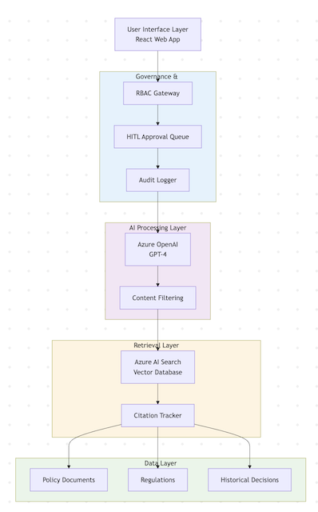

# RAG System Architecture for Regulated Industries: A Production Blueprint

> **A reference architecture for deploying Retrieval-Augmented Generation (RAG) systems in highly regulated environments with embedded AI governance controls.**

[](https://opensource.org/licenses/MIT)
[](https://azure.microsoft.com)
[](https://www.nist.gov/itl/ai-risk-management-framework)

---

## Overview

This repository documents a **production-grade RAG architecture** designed for insurance underwriting knowledge systems, with governance, auditability, and explainability built into every layer—not bolted on afterward.

### Why This Matters

Most RAG implementations fail in regulated environments because they treat governance as an afterthought. This architecture embeds governance controls at the system level, enabling:

- ✅ **Auditability**: Every AI-generated response is traceable to source documents
- ✅ **Explainability**: Users see *why* and *where* answers came from
- ✅ **Human Oversight**: Critical decisions require human approval (HITL)
- ✅ **Access Control**: Role-based retrieval ensures users only see authorized content
- ✅ **Compliance**: Designed for SOC2, regulatory audits, and risk committee scrutiny

### Real-World Impact

This architecture pattern enabled:
- **60% reduction** in manual policy research time for underwriters
- **Risk committee approval** for production GenAI deployment in regulated insurance
- **Zero audit findings** in initial compliance reviews
- **70% faster** resolution of complex underwriting queries

---

## Architecture Overview



### Core Components

#### 1. **Governance & Orchestration Layer**
The "gatekeeper" that enforces AI governance before and after LLM interaction.

**Components:**
- **RBAC Gateway**: Ensures users can only query knowledge bases they're authorized to access
- **HITL Approval Queue**: Routes high-risk queries through human review workflows
- **Audit Logger**: Captures every query, retrieval, and response for compliance tracking

**Key Governance Controls:**
- Role-based access control (RBAC) mapped to underwriting roles
- Risk-based routing (auto-approve low-risk, escalate high-risk)
- Immutable audit trails for regulatory reporting

---

#### 2. **AI Processing Layer**
Where the LLM generates responses with embedded guardrails.

**Components:**
- **LLM Gateway** (Azure OpenAI): Managed endpoint with content filtering
- **Prompt Engineering Framework**: Templates with safety instructions and formatting rules
- **Content Filters**: PII detection, compliance keyword blocking, hallucination detection

**Key Governance Controls:**
- System prompts enforce citation requirements ("always cite sources")
- Output validation (reject responses without source citations)
- Toxicity and bias filtering via Azure Content Safety

---

#### 3. **Retrieval Layer**
The knowledge retrieval system with provenance tracking.

**Components:**
- **Vector Database** (Azure AI Search): Hybrid search (semantic + keyword)
- **Citation Tracker**: Maps every retrieved chunk back to original document + page
- **Relevance Scorer**: Confidence thresholds for retrieval quality

**Key Governance Controls:**
- Document-level security (row-level access control in vector DB)
- Metadata tagging (document classification, sensitivity level)
- Citation linking (every sentence → source document reference)

---

#### 4. **Data Layer**
The secured, curated knowledge base.

**Components:**
- **Policy Documents**: Underwriting guidelines, state regulations
- **Historical Decisions**: Approved underwriting precedents
- **Regulatory Updates**: Real-time feeds from DOIs, NAIC

**Key Governance Controls:**
- Document versioning and change tracking
- Access logging (who accessed what, when)
- Data lineage tracking (source → ingestion → index)

---

## Governance Controls Mapped to NIST AI RMF

| NIST AI RMF Function | Implementation in This Architecture |
|---------------------|-------------------------------------|
| **GOVERN** | RBAC policies, risk assessment workflows, AI governance committee oversight |
| **MAP** | Use case risk classification, impact assessments documented in `/governance` |
| **MEASURE** | Continuous monitoring dashboards, bias/drift detection, audit logs |
| **MANAGE** | HITL approval queues, incident response playbooks, model versioning |

See [`/governance/NIST-AI-RMF-MAPPING.md`](governance/NIST-AI-RMF-MAPPING.md) for detailed mapping.

---

## Getting Started

### Prerequisites
- Azure subscription with Azure OpenAI access
- Azure AI Search instance
- Azure Kubernetes Service (AKS) or App Services
- .NET 8 SDK or Python 3.11+

### Quick Start (Demo Mode)

```bash
# Clone the repository
git clone https://github.com/YourUsername/regulated-rag-architecture.git
cd regulated-rag-architecture

# Review the architecture decision records
cat docs/ADR-001-WHY-RBAC-AT-RETRIEVAL-LAYER.md

# Explore example implementations
cd examples/
cat README.md
```

---

## Repository Structure

```
regulated-rag-architecture/
├── diagrams/               # Architecture diagrams and visuals
│   ├── rag-architecture-overview.png
│   ├── rbac-flow.png
│   └── hitl-approval-workflow.png
├── docs/                   # Architecture Decision Records (ADRs)
│   ├── ADR-001-WHY-RBAC-AT-RETRIEVAL-LAYER.md
│   ├── ADR-002-HITL-APPROVAL-THRESHOLDS.md
│   ├── ADR-003-CITATION-TRACKING-STRATEGY.md
│   └── DEPLOYMENT-GUIDE.md
├── examples/               # Code examples and patterns
│   ├── rbac-gateway/       # Role-based access control implementation
│   ├── citation-tracker/   # Source attribution system
│   ├── hitl-queue/         # Human-in-the-loop approval queue
│   └── audit-logger/       # Compliance logging service
├── governance/             # Governance frameworks and policies
│   ├── NIST-AI-RMF-MAPPING.md
│   ├── RISK-ASSESSMENT-TEMPLATE.md
│   └── RESPONSIBLE-AI-CHECKLIST.md
└── README.md              # This file
```

---

##vKey Architecture Decisions

### 1. **RBAC at the Retrieval Layer (Not Just UI)**

**Decision:** Enforce role-based access control when retrieving documents from the vector database, not just at the UI level.

**Rationale:**
- Prevents unauthorized knowledge leakage through prompt injection
- Ensures auditors can verify "who could access what" at the data layer
- Aligns with principle of least privilege

**Implementation:** See [`examples/rbac-gateway/`](examples/rbac-gateway/)

---

### 2. **Citation Tracking as First-Class Concern**

**Decision:** Every AI-generated sentence must include source document references (e.g., "Policy Manual v2.3, Section 4.2").

**Rationale:**
- Enables underwriters to verify AI recommendations
- Required for audit trails ("how did the system arrive at this answer?")
- Reduces hallucination risk (users can fact-check)

**Implementation:** See [`examples/citation-tracker/`](examples/citation-tracker/)

---

### 3. **Human-in-the-Loop for High-Risk Queries**

**Decision:** Route queries above a risk threshold (e.g., "deny coverage", "exception request") to human reviewers before showing AI responses.

**Rationale:**
- Maintains human accountability for regulated decisions
- Builds trust with risk committees and auditors
- Creates feedback loop for model improvement

**Implementation:** See [`examples/hitl-queue/`](examples/hitl-queue/)

---

## Observability & Monitoring

Production AI systems require continuous monitoring beyond traditional APM.

**Key Metrics Tracked:**
- **Retrieval Quality**: Relevance scores, citation coverage
- **Governance Compliance**: HITL approval rates, access violations
- **Model Performance**: Response latency, token usage, hallucination flags
- **User Adoption**: Query volume, user satisfaction scores

**Tooling:**
- Azure Monitor + Application Insights for infrastructure
- Custom dashboards for AI-specific metrics (Grafana/Power BI)
- Audit log analytics for compliance reporting

---

## Contributing

This is a reference architecture, not production code. Contributions welcome:

- **Architecture improvements**: Open an issue to discuss design changes
- **New governance patterns**: Submit ADRs for additional controls
- **Code examples**: Add implementations in other languages/frameworks

---

## License

MIT License - See [LICENSE](LICENSE) for details.

---

## About the Author

**Sundar Nalli** | Enterprise AI Governance & GenAI Transformation Architect

- 🔗 [LinkedIn](https://linkedin.com/in/sundarnalli) | [GitHub](https://github.com/SundarNalli)

*Specialized in deploying production-grade GenAI systems in highly regulated industries (banking, insurance, financial services) with embedded governance, auditability, and explainability.*

---

## Acknowledgments

This architecture evolved from real-world production systems deployed in regulated insurance environments. Special thanks to:
- The risk, compliance, and security teams who shaped governance requirements
- The underwriting teams who provided user feedback and domain expertise
- The engineering teams who turned governance principles into working systems

---

## Related Resources

- [NIST AI Risk Management Framework](https://www.nist.gov/itl/ai-risk-management-framework)
- [ISO/IEC 42001 - AI Management Systems](https://www.iso.org/standard/81230.html)
- [Azure OpenAI Service - Responsible AI](https://learn.microsoft.com/en-us/azure/ai-services/openai/concepts/responsible-ai)
- [Building Trustworthy AI Systems (Google)](https://ai.google/responsibility/responsible-ai-practices/)

---

** Important Note:** This repository describes architectural patterns and design principles. It does not contain proprietary code, customer data, or confidential information from any organization. All examples are generalized for educational purposes.

---

** If this helped you design governed AI systems, please star the repository and share with your network!**
